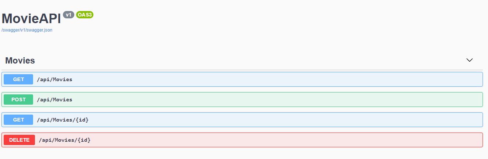
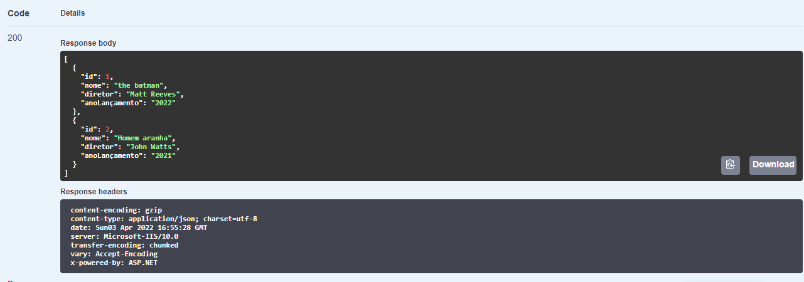
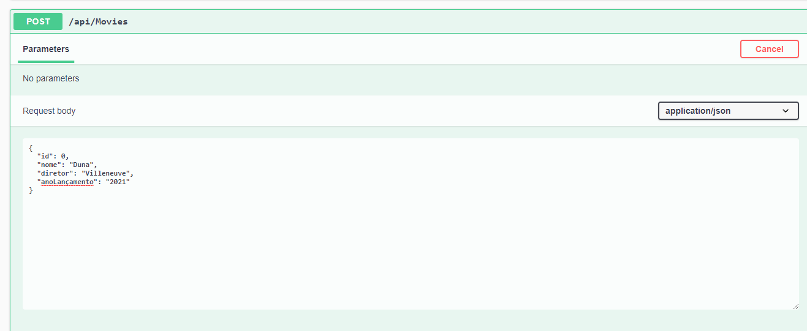
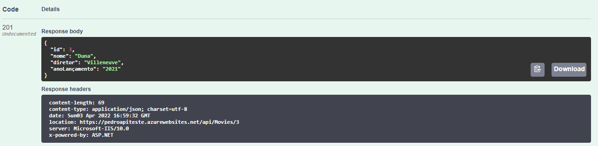
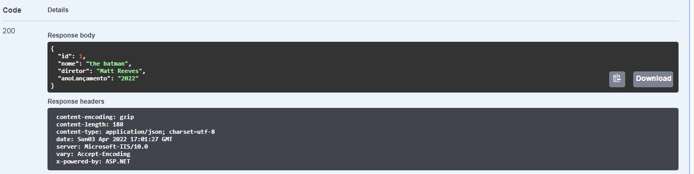
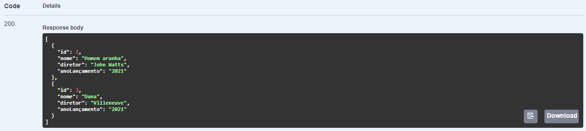

# API-TESTE-PRATICO
Api realizada em C# para o teste prático.

Link: https://pedroapiteste.azurewebsites.net/swagger/index.html

Resumo: Api criada em C# com o tema de filmes, possui a função de adicionar, excluir e mostrar filmes.

Tela Inicial: 

Instruções:
Método Get -> Try it out -> Execute  

Resultado: É retornado a lista de filmes cadastrados, nesse caso, The Batman e Homem Aranha

Instruções:
Método Post -> Try it out -> Execute  
Antes de executar, é preciso inserir o nome, diretor e ano de lançamento nos respectivos campos para cadastrar o filme

Resultado: É retornado o filme cadatrado

Instruções:
Método Get(id) -> Try it out -> id -> Execute  
Antes de executar, é preciso inserir o id do filme que quer mostrar. Nesse caso, inseri o id 1.

Instruções:
Método Delete -> Try it out -> id -> Execute  
Antes de executar, é preciso inserir o id do filme que quer deletar. Nesse caso, inseri o id 1.

